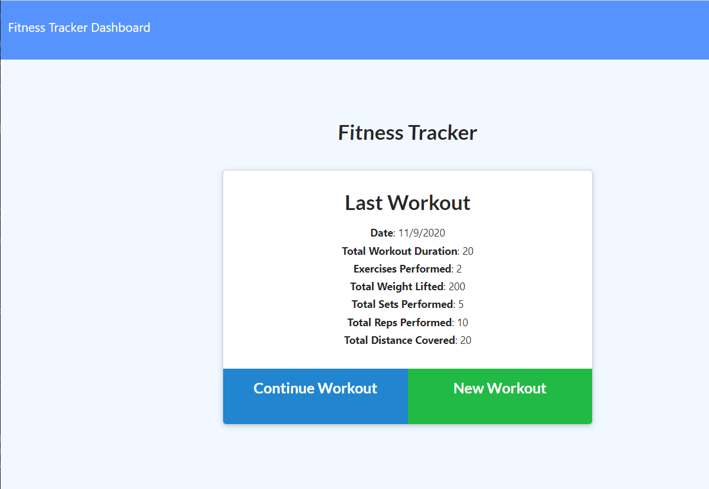

# Workout-Tracker

## Table of Contents

- [Description](#Description)
- [Screen Shots](#Screen-Shots)
- [Technology Used](#Technology-Used)
- [License](#license)

## Deployed Site
 ## [Click Here ](https://z-workout-tracker.herokuapp.com/?id=5fa8e15bfad7560017e3dd0e)

## Description

This app is a workout tracker that saves data on MongoDB and is deployed on Heroku.\
The user can keep adding to an existing exercise to keep track of their workouts or can create a new exercise when ever they want. The workouts can also be tracked and be displayed on a graph(dashboard link). 
## Screen-Shots

## Technology-Used

- HTML 
- CSS
- Javascript
- Express
- MongoDB / Mongo Atlas
- Heroku

## License

## Question

If you have any questions please feel free to contact me.\
**Email:** zakfena@gmail.com\
**Git Hub** https://github.com/ZAKFENA
